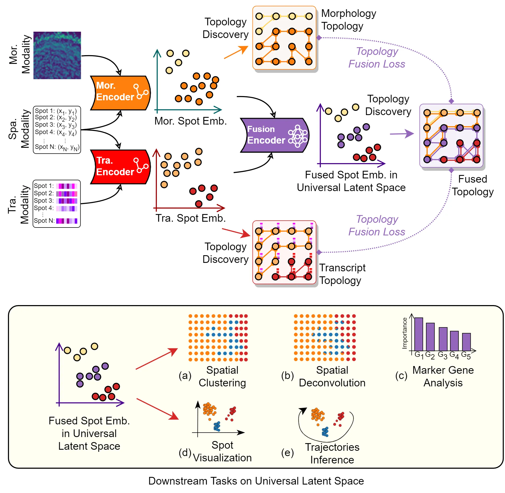
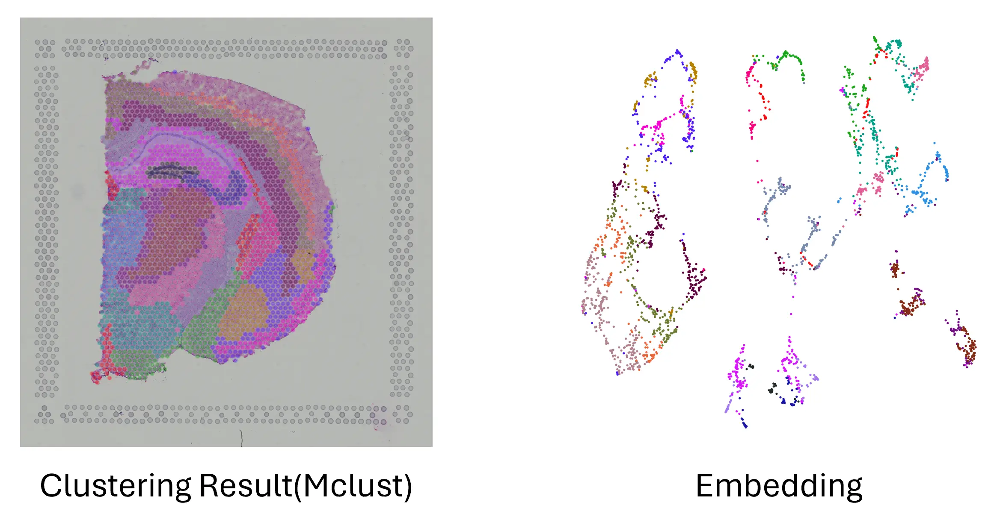

# Must: Maximizing Latent Capacity of Spatial Transcriptomics Data



Spatial transcriptomics (ST) technologies have revolutionized the study of gene expression patterns in tissues by providing multimodality data in transcriptomic, spatial, and morphological, offering opportunities for understanding tissue biology beyond transcriptomics. However, we identify the modality bias phenomenon in ST data species, i.e., the inconsistent contribution of different modalities to the labels leads to a tendency for the analysis methods to retain the information of the dominant modality. How to mitigate the adverse effects of modality bias to satisfy various downstream tasks remains a fundamental challenge. This paper introduces Multiple-modality Structure Transformation, named MuST, a novel methodology to tackle the challenge. MuST integrates the multi-modality information contained in the ST data effectively into a uniform latent space to provide a foundation for all the downstream tasks. It learns intrinsic local structures by topology discovery strategy and topology fusion loss function to solve the inconsistencies among different modalities. Thus, these topology-based and deep learning techniques provide a solid foundation for a variety of analytical tasks while coordinating different modalities. The effectiveness of MuST is assessed by performance metrics and biological significance. The results show that it outperforms existing state-of-the-art methods with clear advantages in the precision of identifying and preserving structures of tissues and biomarkers. MuST offers a versatile toolkit for the intricate analysis of complex biological systems.

Full paper can be downloaded via [arxiv](https://arxiv.org/abs/2401.07543).

## Configurating python environment

We recommend using conda for configuration. You can refer to our `envrionment.yml` to configure the environment or try `conda env create`.

```bash
conda env create -f environment.yml
```

## Run MuST

You can run MuST with a single line of code to get spatial clustering result and its latent embedding.

### Minimun replication

Running minimal replication can be done with the following command:

```bash
python main_MuST.py
```

We use V1_Adult_Mouse_Brain(from 10x Visium) dataset for demonstration. On our 64-core A100 machine, it usually lasts about 4 minutes. Sample result is provided below:



### Multi platform support

For 10x Visium platform, datasets are downloaded and handled automatically. 
For Stereo-seq and SlideSeq platforms, check section `Data Description` in our paper to get data. 

We provided a universal standard to handle multi platform datasets. Some datasets need to be processed as one file and its path should be `data/<dataset>/data.h5ad`.

```bash
python main_MuST.py --dataset=<dataset>
```

### Other Specifications

- **more clustering methods**: we employ louvain and leiden as alternative clustering method. Augments are `plot_leiden` and `plot_louvain`.

## Explore MuST

We recommand to use `wandb` to log and view results. Wandb result url can be found in command line once the run is finished. For deeper insights, the structure of MuST result is demonstrated below

```bash
result
|-- V1_Adult_Mouse_Brain
    |-- emb.npy             # embedding
    |-- emb_2d.npy          # 2D embedding suggested by umap
    |-- hvg.npy             # highly variable genes selection mask
    |-- mclust.png          # spatial clustering result by MClust
    |-- mclust_emb.png      # 2D embedding colored by spatial clustering result
    |-- pred_main.npy       # MClust result
    |-- setting.txt
```

We provide Downstream Task Demos in `downstream_task_demo`.

## Cite us

```bib
@misc{zang2024must,
      title={Must: Maximizing Latent Capacity of Spatial Transcriptomics Data}, 
      author={Zelin Zang and Liangyu Li and Yongjie Xu and Chenrui Duan and Kai Wang and Yang You and Yi Sun and Stan Z. Li},
      year={2024},
      eprint={2401.07543},
      archivePrefix={arXiv},
      primaryClass={cs.CE}
}
```

